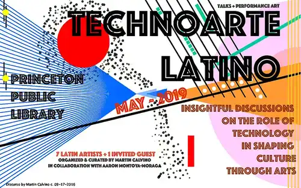

# talk-media-arts-open-source-technoartelatino-princeton

Talk at event TechnoArteLatino, Princeton Public Library, Sunday May 5th 2019

## About

Talk for the event [TechnoArteLatino](https://technoartelatino.github.io/), at [Princeton Public Library](https://princetonlibrary.org/), Sunday May 5th 2019, by [Aarón Montoya-Moraga](http://montoyamoraga.io/). This event was curated and organized by [Martin Calvino](https://www.martincalvino.co/) and [Aarón Montoya-Moraga](http://montoyamoraga.io/).

Aarón Montoya-Moraga:
* Chile, 1989
* Artist / electrical engineer / programmer / teacher
* Open source educator and worker
* Master in media arts, New York University
* Researcher at Poetic Justice, MIT Media Lab
* Processing Foundation / p5.js collaborator.
* Founder of label bandurria

For more links and information, please visit [art-notes](https://github.com/montoyamoraga/art-notes).

## Event information

[TechnoArteLatino website](http://technoartelatino.github.io).

[TechnoArteLatino event at the Princeton Public Library website](https://princetonlibrary.org/event/technoarte-latino/)

## Communities

* [Comunidad electroacústica de Chile, Chile](http://www.aimaako.cl/)
* [CODED Escuela, Chile](http://facebook.com/codedescuela)
* [Blackaut Santiago](https://www.facebook.com/blackaut.stgo/)
* [Sinestesia, Chile](http://www.sinestesia.cc/)
* [Interactive Telecommunications Program, New York University, USA](https://tisch.nyu.edu/itp)
* [Integrated Digital Media, New York University, USA](http://idm.engineering.nyu.edu/)
* [MIT Media Lab, USA](https://www.media.mit.edu/)
* [Design Media Arts, University of California Los Angeles, Los Angeles, USA](http://dma.ucla.edu/)
* [Emergent Digital Practices, University of Denver, USA](https://www.du.edu/ahss/edp/)
* [Design and Technology, The New School, USA](https://www.newschool.edu/parsons/mfa-design-technology/)
* [New Latin Wave Festival, USA](https://newlatinwave.com/)
* [Processing Foundation, USA](https://processingfoundation.org/)
* [School for Poetic Computation, USA](http://sfpc.io/)
* [School of Machines, Making & Make-Believe, Germany](http://schoolofma.org/)

## Festivals and conferences

* [Afrotectopia](https://www.afrotectopia.com/), USA
* [Ai Maako](http://www.aimaako.cl/), Chile.
* [Campamento de verano cyberpunk](https://www.facebook.com/veranoCyberpunk/), Chile.
* [Encuentro Lumen](http://www.encuentrolumen.net/), Chile.
* [eyeo festival](http://eyeofestival.com/), USA
* [International Conference on Live Coding](https://iclc.livecodenetwork.org/)
* [New Latin Wave](https://newlatinwave.com/), USA.
* [pluscode festival](http://pluscode.cc/), Argentina.

## Labels and publishers

* [bandurria](https://bandurria.io/), sound art label.
* [Processing Foundation Press](http://processingfoundation.press/), books by The Processing Foundation.
* [Uva Robot](https://uvarobot.cl/), experimental music label.
* [Vano Editorial](http://www.vanoeditorial.cl/), artist books.

## License

MIT
